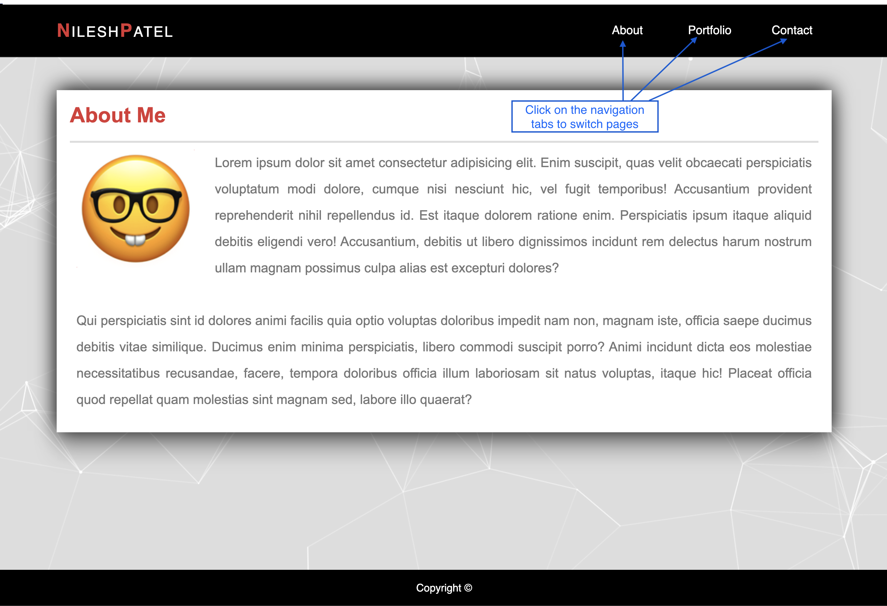
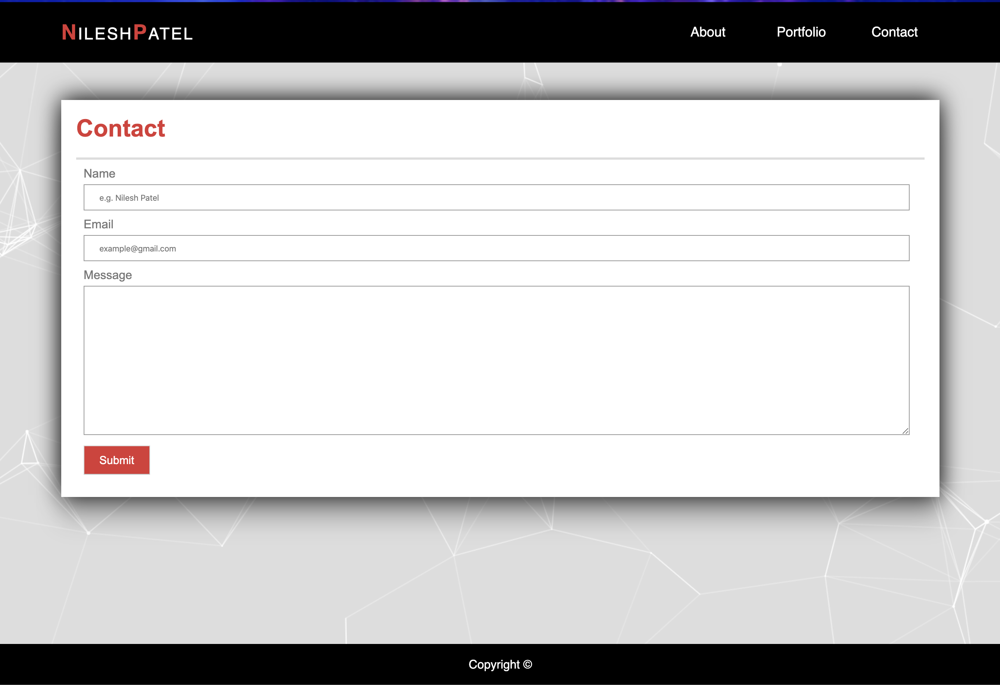
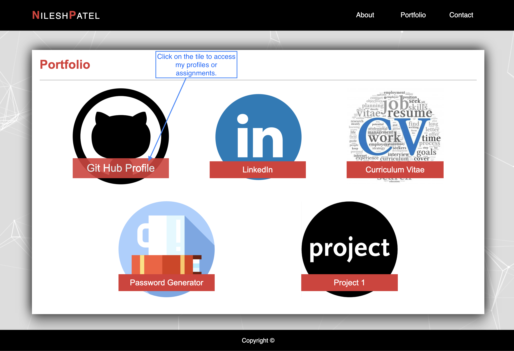
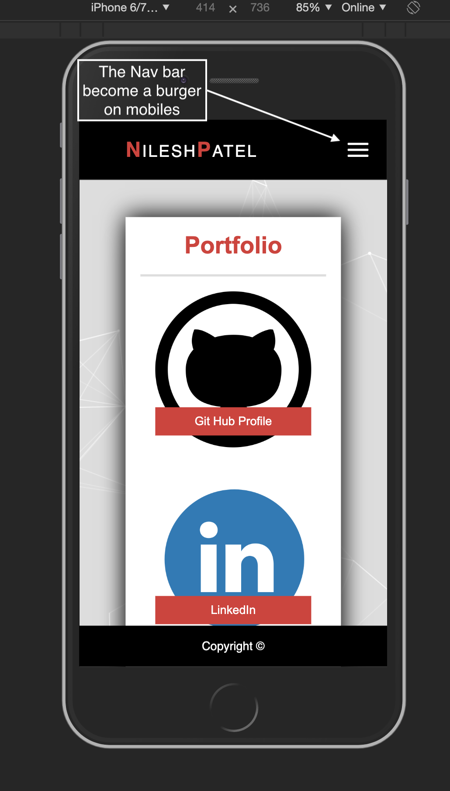
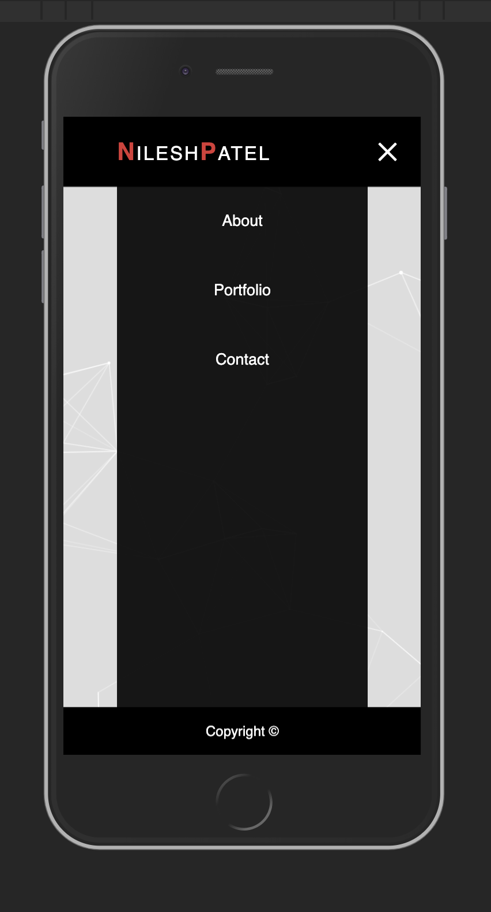

# Profile Web-Page 

## Description 

This is a website that showcases a progressive development of my studies. This website will progress further as I progress through the course.

Within the header we have a navigation bar which takes us to a different page. Each page demonstrates a different topic we covered in class, from simple understanding of html tags to flex box.  

It have been made responsive for mobile first use.

## Usage 

Mobile screens will have a burger icon to switch between pages and navigate been pages.

## Link

To experience the website first hand follow this link .

## License

Copyright (c) Microsoft Corporation. All rights reserved.

Licensed under the [MIT] license.
MIT License

Copyright (c) [2019]
---
